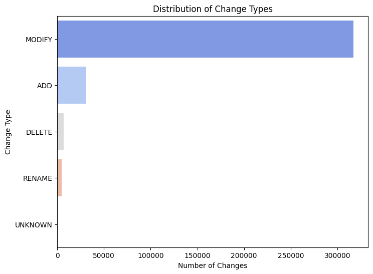
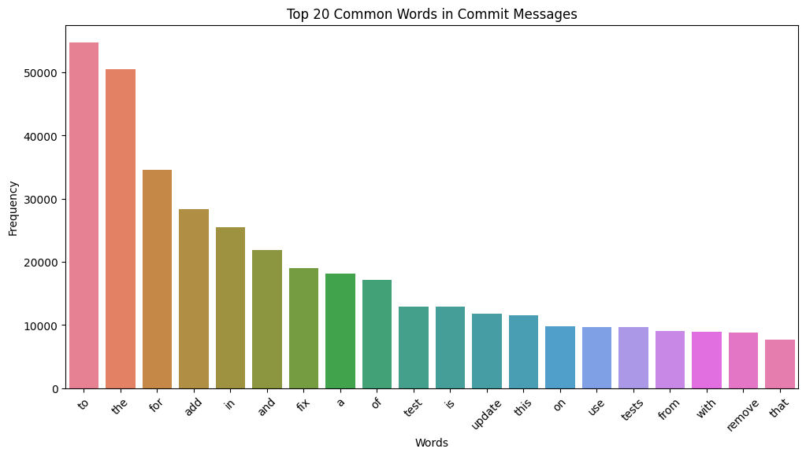
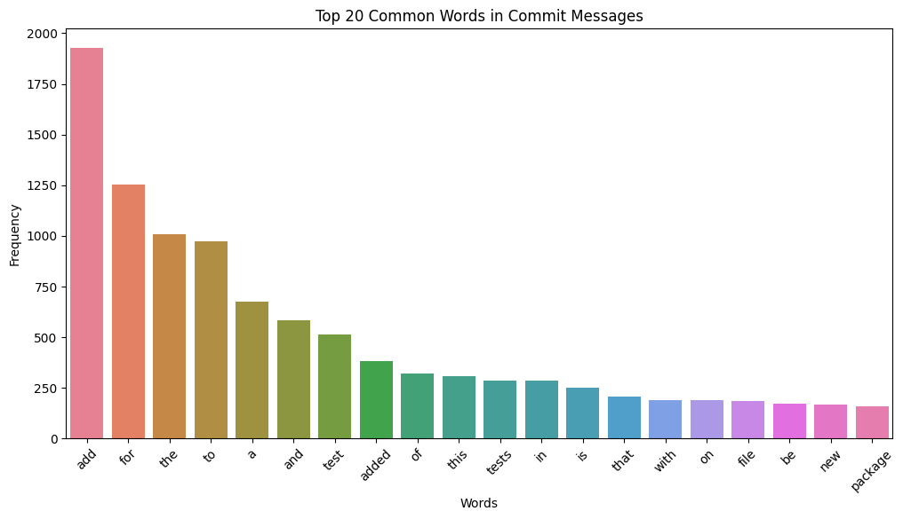
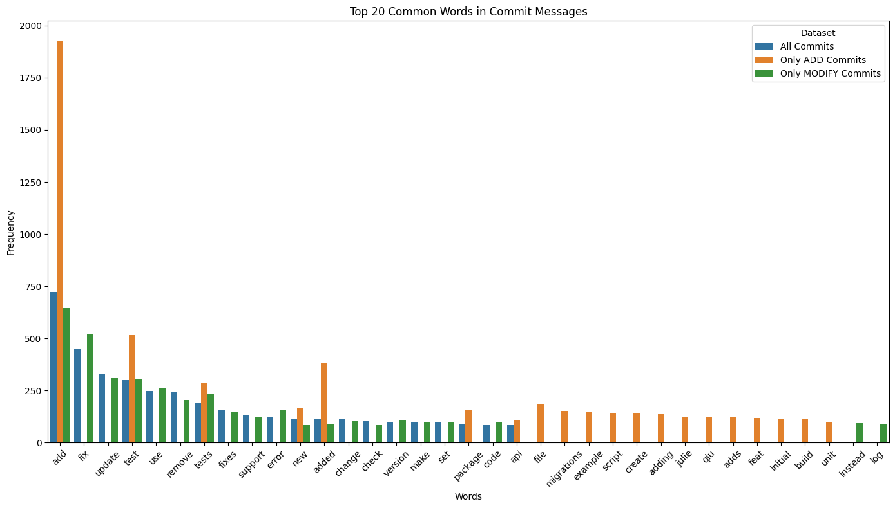

# Commit Chronicle Dataset

This notebook investigates the [Commit Chronicle dataset](https://huggingface.co/datasets/JetBrains-Research/commit-chronicle) introduced in the paper ["From Commit Message Generation to History-Aware Commit Message Completion", ASE 2023](https://arxiv.org/abs/2308.07655) - loading, filtering, EDA and preprocessing


```python
import multiprocessing as mp
from functools import partial

import rootutils
from datasets import load_dataset, load_from_disk
```


```python
ROOT = rootutils.setup_root(".", ".project-root", pythonpath=True)
OUTPUT_DIR = ROOT / "data/playground"
```

## Loading and Filtering

Note: Filtering logic is implemented in `CommitChroniclePreprocessor`


```python
# Run this cell to continue with the rest of this notebook.

SPLIT = "validation"  # we select this split as it's small for our EDA, feel free to change to `train` split if u want
LANGUAGES = ["Go"]

filtered = OUTPUT_DIR / "01-filtered-validation"


# we don't directly reference `LANGUAGES` in the function because in python multiprocessing,
# all functions passed as parameters shouldn't reference variables outside of them
def filter_dataset(example, languages):
    return example["language"] in languages 


if not filtered.exists():
    (
        load_dataset("JetBrains-Research/commit-chronicle", "default", split=SPLIT)
        .filter(partial(filter_dataset, languages=LANGUAGES), num_proc=mp.cpu_count())
        .save_to_disk(filtered)
    )
dataset = load_from_disk(filtered)
```


```python
dataset.select(range(10)).to_pandas()
```


<div>
<style scoped>
    .dataframe tbody tr th:only-of-type {
        vertical-align: middle;
    }

    .dataframe tbody tr th {
        vertical-align: top;
    }

    .dataframe thead th {
        text-align: right;
    }
</style>
<table border="1" class="dataframe">
  <thead>
    <tr style="text-align: right;">
      <th></th>
      <th>author</th>
      <th>date</th>
      <th>timezone</th>
      <th>hash</th>
      <th>message</th>
      <th>mods</th>
      <th>language</th>
      <th>license</th>
      <th>repo</th>
      <th>original_message</th>
    </tr>
  </thead>
  <tbody>
    <tr>
      <th>0</th>
      <td>770513</td>
      <td>10.01.2019 15:18:16</td>
      <td>-3600</td>
      <td>f23663976c895cdd02c0e284c86fb734614daed1</td>
      <td>Add code to retrieve the correct user director...</td>
      <td>[{'change_type': 'ADD', 'old_path': None, 'new...</td>
      <td>Go</td>
      <td>BSD 3-Clause New or Revised License</td>
      <td>bios-marcel/cordless</td>
      <td>Add code to retrieve the correct user director...</td>
    </tr>
    <tr>
      <th>1</th>
      <td>770513</td>
      <td>10.01.2019 15:34:00</td>
      <td>-3600</td>
      <td>0773af1d2282008fe47952e2d987ac3409e3e711</td>
      <td>Add files for starting the application and pri...</td>
      <td>[{'change_type': 'ADD', 'old_path': None, 'new...</td>
      <td>Go</td>
      <td>BSD 3-Clause New or Revised License</td>
      <td>bios-marcel/cordless</td>
      <td>Add files for starting the application and pri...</td>
    </tr>
    <tr>
      <th>2</th>
      <td>770513</td>
      <td>10.01.2019 15:34:30</td>
      <td>-3600</td>
      <td>c536eb16f961d36c22ef7ad5fcb3082de59ca771</td>
      <td>Add a readme that explains the crucial stuff</td>
      <td>[{'change_type': 'ADD', 'old_path': None, 'new...</td>
      <td>Go</td>
      <td>BSD 3-Clause New or Revised License</td>
      <td>bios-marcel/cordless</td>
      <td>Add a readme that explains the crucial stuff</td>
    </tr>
    <tr>
      <th>3</th>
      <td>770513</td>
      <td>10.01.2019 16:00:09</td>
      <td>-3600</td>
      <td>fcbfaca10cf0adcf301540a7995c4cb01d94e641</td>
      <td>Add docs to run method</td>
      <td>[{'change_type': 'MODIFY', 'old_path': 'intern...</td>
      <td>Go</td>
      <td>BSD 3-Clause New or Revised License</td>
      <td>bios-marcel/cordless</td>
      <td>Add docs to run method</td>
    </tr>
    <tr>
      <th>4</th>
      <td>770513</td>
      <td>10.01.2019 17:17:41</td>
      <td>-3600</td>
      <td>b410449ff5e0f8d3bb29f678a9b0f9b561e124ad</td>
      <td>Implement initial loading, asking for toking a...</td>
      <td>[{'change_type': 'MODIFY', 'old_path': 'README...</td>
      <td>Go</td>
      <td>BSD 3-Clause New or Revised License</td>
      <td>bios-marcel/cordless</td>
      <td>Implement initial loading, asking for toking a...</td>
    </tr>
    <tr>
      <th>5</th>
      <td>770513</td>
      <td>10.01.2019 19:57:34</td>
      <td>-3600</td>
      <td>6d29e27da2b518782298f2f079be75c9c0f7227e</td>
      <td>Make AppName variables constants</td>
      <td>[{'change_type': 'MODIFY', 'old_path': 'intern...</td>
      <td>Go</td>
      <td>BSD 3-Clause New or Revised License</td>
      <td>bios-marcel/cordless</td>
      <td>Make AppName variables constants</td>
    </tr>
    <tr>
      <th>6</th>
      <td>770513</td>
      <td>11.01.2019 15:03:10</td>
      <td>-3600</td>
      <td>ac05a556865b7a901f3b7715d6e91570eb899e7c</td>
      <td>Add first prototype.\nThe prototype contains s...</td>
      <td>[{'change_type': 'MODIFY', 'old_path': 'intern...</td>
      <td>Go</td>
      <td>BSD 3-Clause New or Revised License</td>
      <td>bios-marcel/cordless</td>
      <td>Add first prototype.\n\nThe prototype contains...</td>
    </tr>
    <tr>
      <th>7</th>
      <td>770513</td>
      <td>11.01.2019 15:33:29</td>
      <td>-3600</td>
      <td>d78216c85896929f46741c23f28f3b870998862b</td>
      <td>Fixed a bug where all messages of a channel we...</td>
      <td>[{'change_type': 'MODIFY', 'old_path': 'intern...</td>
      <td>Go</td>
      <td>BSD 3-Clause New or Revised License</td>
      <td>bios-marcel/cordless</td>
      <td>Fixed a bug where all messages of a channel we...</td>
    </tr>
    <tr>
      <th>8</th>
      <td>770513</td>
      <td>11.01.2019 15:56:57</td>
      <td>-3600</td>
      <td>a66149802815d7caa1fb56eaf53ea838d3fc4331</td>
      <td>Messages are now all loaded, if there were del...</td>
      <td>[{'change_type': 'MODIFY', 'old_path': 'intern...</td>
      <td>Go</td>
      <td>BSD 3-Clause New or Revised License</td>
      <td>bios-marcel/cordless</td>
      <td>Messages are now all loaded, if there were del...</td>
    </tr>
    <tr>
      <th>9</th>
      <td>770513</td>
      <td>12.01.2019 01:56:41</td>
      <td>-3600</td>
      <td>a4c519d5b413b846021f48517e86860beeaad7e5</td>
      <td>Fix channel loading, now all messages are load...</td>
      <td>[{'change_type': 'MODIFY', 'old_path': 'intern...</td>
      <td>Go</td>
      <td>BSD 3-Clause New or Revised License</td>
      <td>bios-marcel/cordless</td>
      <td>Fix channel loading, now all messages are load...</td>
    </tr>
  </tbody>
</table>
</div>


```python
dataset.select(range(1))[0]["mods"][0].keys()

```


    dict_keys(['change_type', 'old_path', 'new_path', 'diff'])


```python
dataset.select(range(1))
```


    Dataset({
        features: ['author', 'date', 'timezone', 'hash', 'message', 'mods', 'language', 'license', 'repo', 'original_message'],
        num_rows: 1
    })


## EDA

### Column names

These are the columns we have in our dataset and an example of each


```python
print(
    dataset.column_names
)  # ['author','date','timezone','hash','message','mods','language','license','repo','original_message']

subset = dataset.select(range(10))

for element in subset:
    print(element)

subset[0][
    "mods"
]  # 'Mods' will have multiple changes in different files. need to be appended accordingly. Its length varies.
```

    ['author', 'date', 'timezone', 'hash', 'message', 'mods', 'language', 'license', 'repo', 'original_message']
    {'author': 770513, 'date': '10.01.2019 15:18:16', 'timezone': -3600, 'hash': 'f23663976c895cdd02c0e284c86fb734614daed1', 'message': 'Add code to retrieve the correct user directory on windows and linux ... and a somewhat okayish directory on macos"', 'mods': [{'change_type': 'ADD', 'old_path': None, 'new_path': 'internal/config/config.go', 'diff': '+package config\n+\n+import "strings"\n+\n+var (\n+ //AppName is the name representing the application.\n+ AppName = "Cordless"\n+ //AppNameLowercase is the representative name, but lowercase.\n+ //It us used for filepaths and such.\n+ AppNameLowercase = strings.ToLower(AppName)\n+)\n+\n+//Config contains all possible configuration for the application.\n+type Config struct {\n+ Token string\n+}\n+\n+var cachedConfigDir string\n+\n+//GetConfigDirectory is the parent directory in the os, that contains the\n+//settings for the application.\n+func GetConfigDirectory() (string, error) {\n+ if cachedConfigDir != "" {\n+ return cachedConfigDir, nil\n+ }\n+\n+ directory, err := getConfigDirectory()\n+ if err != nil {\n+ return "", err\n+ }\n+\n+ cachedConfigDir = directory\n+ return cachedConfigDir, nil\n+}\n'}, {'change_type': 'ADD', 'old_path': None, 'new_path': 'internal/config/os_darwin.go', 'diff': '+package config\n+\n+import (\n+ "os/user"\n+ "path/filepath"\n+)\n+\n+func getConfigDirectory() (string, error) {\n+ //TODO Gotta research this\n+\n+ currentUser, userError := user.Current()\n+\n+ if userError != nil {\n+ return "", userError\n+ }\n+\n+ return filepath.Join(currentUser.HomeDir, "."+AppNameLowercase), nil\n+}\n'}, {'change_type': 'ADD', 'old_path': None, 'new_path': 'internal/config/os_linux.go', 'diff': '+package config\n+\n+import (\n+ "os"\n+ "os/user"\n+ "path/filepath"\n+)\n+\n+func getConfigDirectory() (string, error) {\n+ configDir := os.Getenv("XDG_CONFIG_DIR")\n+\n+ if configDir != "" {\n+ return configDir, nil\n+ }\n+\n+ currentUser, userError := user.Current()\n+\n+ if userError != nil {\n+ return "", userError\n+ }\n+\n+ return filepath.Join(currentUser.HomeDir, ".config", AppNameLowercase), nil\n+}\n'}, {'change_type': 'ADD', 'old_path': None, 'new_path': 'internal/config/os_windows.go', 'diff': '+package config\n+\n+import (\n+ "os"\n+ "os/user"\n+ "path/filepath"\n+)\n+\n+func getConfigDirectory() (string, error) {\n+ configDir := os.Getenv("APPDATA")\n+\n+ if configDir != "" {\n+ return filepath.Join(configDir, AppNameLowercase), nil\n+ }\n+\n+ currentUser, userError := user.Current()\n+\n+ if userError != nil {\n+ return "", userError\n+ }\n+\n+ return filepath.Join(currentUser.HomeDir, "AppData", "Roaming", AppNameLowercase), nil\n+}\n'}], 'language': 'Go', 'license': 'BSD 3-Clause New or Revised License', 'repo': 'bios-marcel/cordless', 'original_message': 'Add code to retrieve the correct user directory on windows and linux ... and a somewhat okayish directory on macos"'}
    {'author': 770513, 'date': '10.01.2019 15:34:00', 'timezone': -3600, 'hash': '0773af1d2282008fe47952e2d987ac3409e3e711', 'message': 'Add files for starting the application and printing the config directory location', 'mods': [{'change_type': 'ADD', 'old_path': None, 'new_path': 'cordless.go', 'diff': '+package main\n+\n+import "github.com/Bios-Marcel/cordless/internal"\n+\n+func main() {\n+ internal.Run()\n+}\n'}, {'change_type': 'ADD', 'old_path': None, 'new_path': 'internal/app.go', 'diff': '+package internal\n+\n+import (\n+ "log"\n+\n+ "github.com/Bios-Marcel/cordless/internal/config"\n+)\n+\n+func Run() {\n+ configDir, configErr := config.GetConfigDirectory()\n+\n+ if configErr != nil {\n+ log.Fatalf("Unable to determine configuration directory (%s)\\n", configErr.Error())\n+ }\n+\n+ log.Printf("Configuration lies at: %s\\n", configDir)\n+}\n'}], 'language': 'Go', 'license': 'BSD 3-Clause New or Revised License', 'repo': 'bios-marcel/cordless', 'original_message': 'Add files for starting the application and printing the config directory location'}
    {'author': 770513, 'date': '10.01.2019 15:34:30', 'timezone': -3600, 'hash': 'c536eb16f961d36c22ef7ad5fcb3082de59ca771', 'message': 'Add a readme that explains the crucial stuff', 'mods': [{'change_type': 'ADD', 'old_path': None, 'new_path': 'README.md', 'diff': "+# Cordless\n+\n+Cordless is supposed to be a custom [Discord](https://discordapp.com) client\n+that aims to have a low memory footprint and be aimed at powerusers.\n+\n+This project was mainly inspired by [Southclaws](https://github.com/Southclaws)\n+[Cordless](https://github.com/Southclaws/cordless), which he sadly didn't\n+develop any further.\n+\n+## How to use it\n+\n+### Installation\n+\n+First you have to grab the code via:\n+\n+```shell\n+go get github.com/Bios-Marcel/cordless\n+```\n+\n+In order to execute this command\n+[you need to have go installed](https://golang.org/doc/install).\n+\n+In order to execute the application, simply run the executable, which lies at\n+`$GOPATH/bin/cordless`. In order to be able to run this from your commandline,\n+`$GOPATH/bin` has to be in your `PATH` variable.\n+\n+### Configuration\n+\n+Cordless doesn't need anything besides your Discord token. In order to retrieve\n+your token, simply follow the steps in the graphic below:\n+\n+\n+\n+After retrieving the token, you have to insert it into the `Token` field of\n+your configuration file. In order to find the location of the configuration\n+file, simply run cordless via your terminal and check the output, as it will\n+tell you, where its configuration file lies.\n\\ No newline at end of file\n"}], 'language': 'Go', 'license': 'BSD 3-Clause New or Revised License', 'repo': 'bios-marcel/cordless', 'original_message': 'Add a readme that explains the crucial stuff'}
    {'author': 770513, 'date': '10.01.2019 16:00:09', 'timezone': -3600, 'hash': 'fcbfaca10cf0adcf301540a7995c4cb01d94e641', 'message': 'Add docs to run method', 'mods': [{'change_type': 'MODIFY', 'old_path': 'internal/app.go', 'new_path': 'internal/app.go', 'diff': '@@ -6,6 +6,8 @@ import (\n"github.com/Bios-Marcel/cordless/internal/config"\n)\n+//Run launches the whole application and might abort in case it encounters an\n+//error.\nfunc Run() {\nconfigDir, configErr := config.GetConfigDirectory()\n'}], 'language': 'Go', 'license': 'BSD 3-Clause New or Revised License', 'repo': 'bios-marcel/cordless', 'original_message': 'Add docs to run method'}
    {'author': 770513, 'date': '10.01.2019 17:17:41', 'timezone': -3600, 'hash': 'b410449ff5e0f8d3bb29f678a9b0f9b561e124ad', 'message': 'Implement initial loading, asking for toking and persisting the configutation.', 'mods': [{'change_type': 'MODIFY', 'old_path': 'README.md', 'new_path': 'README.md', 'diff': "@@ -26,12 +26,16 @@ In order to execute the application, simply run the executable, which lies at\n### Configuration\n-Cordless doesn't need anything besides your Discord token. In order to retrieve\n-your token, simply follow the steps in the graphic below:\n+Cordless doesn't need anything besides your Discord token. The application will\n+ask you to input the token in case it can't be found.\n+\n+In order to retrieve your token, simply follow the steps in the graphic below:\n\n-After retrieving the token, you have to insert it into the `Token` field of\n-your configuration file. In order to find the location of the configuration\n-file, simply run cordless via your terminal and check the output, as it will\n-tell you, where its configuration file lies.\n\\ No newline at end of file\n+After retrieving the token, you have to insert it into the input prompt.\n+\n+Alternative, you can manually insert it into your configuration file.\n+In order to find the location of the configuration file, simply run\n+cordless via your terminal and check the output, as it will tell you, where\n+its configuration file lies.\n\\ No newline at end of file\n"}, {'change_type': 'MODIFY', 'old_path': 'internal/app.go', 'new_path': 'internal/app.go', 'diff': 'package internal\nimport (\n+ "bufio"\n"log"\n+ "os"\n+ "strings"\n"github.com/Bios-Marcel/cordless/internal/config"\n)\n@@ -16,4 +19,37 @@ func Run() {\n}\nlog.Printf("Configuration lies at: %s\\n", configDir)\n+\n+ configuration, configLoadError := config.LoadConfig()\n+\n+ if configLoadError != nil {\n+ log.Fatalf("Error loading configuration file (%s).\\n", configLoadError.Error())\n+ }\n+\n+ if configuration.Token == "" {\n+ log.Println("The Discord token could not be found, please input your token.")\n+ configuration.Token = askForToken()\n+ persistError := config.PersistConfig()\n+ if persistError != nil {\n+ log.Fatalf("Error persisting configuration (%s).\\n", persistError.Error())\n+ }\n+ }\n+}\n+\n+func askForToken() string {\n+ reader := bufio.NewReader(os.Stdin)\n+ token, inputError := reader.ReadString(\'\\n\')\n+\n+ if inputError != nil {\n+ log.Fatalf("Error reading your token (%s).\\n", inputError.Error())\n+ }\n+\n+ if token == "" {\n+ log.Println("An empty token is not valid, please try again.")\n+ return askForToken()\n+ }\n+\n+ token = strings.TrimSuffix(token, "\\n")\n+\n+ return token\n}\n'}, {'change_type': 'MODIFY', 'old_path': 'internal/config/config.go', 'new_path': 'internal/config/config.go', 'diff': 'package config\n-import "strings"\n+import (\n+ "encoding/json"\n+ "io"\n+ "io/ioutil"\n+ "os"\n+ "path/filepath"\n+ "strings"\n+)\nvar (\n//AppName is the name representing the application.\n@@ -8,6 +15,8 @@ var (\n//AppNameLowercase is the representative name, but lowercase.\n//It us used for filepaths and such.\nAppNameLowercase = strings.ToLower(AppName)\n+\n+ currentConfig = Config{}\n)\n//Config contains all possible configuration for the application.\n@@ -17,6 +26,18 @@ type Config struct {\nvar cachedConfigDir string\n+//GetConfigFile returns the absolute path to the configuration file or an error\n+//in case of failure.\n+func GetConfigFile() (string, error) {\n+ configDir, configError := GetConfigDirectory()\n+\n+ if configError != nil {\n+ return "", configError\n+ }\n+\n+ return filepath.Join(configDir, "config.json"), nil\n+}\n+\n//GetConfigDirectory is the parent directory in the os, that contains the\n//settings for the application.\nfunc GetConfigDirectory() (string, error) {\n@@ -29,6 +50,73 @@ func GetConfigDirectory() (string, error) {\nreturn "", err\n}\n+ _, statError := os.Stat(directory)\n+ if os.IsNotExist(statError) {\n+ createDirsError := os.MkdirAll(directory, 0755)\n+ if createDirsError != nil {\n+ return "", createDirsError\n+ }\n+ } else if statError != nil {\n+ return "", statError\n+ }\n+\n+ //After first retrieval, we will save this, as we needn\'t redo all that\n+ //stuff over and over again.\ncachedConfigDir = directory\n+\nreturn cachedConfigDir, nil\n}\n+\n+//GetConfig returns the currently loaded configuration.\n+func GetConfig() *Config {\n+ return &currentConfig\n+}\n+\n+//LoadConfig loads the configuration initially and returns it.\n+func LoadConfig() (*Config, error) {\n+ configFilePath, configError := GetConfigFile()\n+ if configError != nil {\n+ return nil, configError\n+ }\n+\n+ configFile, openError := os.Open(configFilePath)\n+\n+ if os.IsNotExist(openError) {\n+ return GetConfig(), nil\n+ }\n+\n+ if openError != nil {\n+ return nil, openError\n+ }\n+\n+ defer configFile.Close()\n+ decoder := json.NewDecoder(configFile)\n+ configLoadError := decoder.Decode(&currentConfig)\n+\n+ //io.EOF would mean empty, therefore we use defaults.\n+ if configLoadError != nil && configLoadError != io.EOF {\n+ return nil, configLoadError\n+ }\n+\n+ return GetConfig(), nil\n+}\n+\n+//PersistConfig saves the current configuration onto the filesystem.\n+func PersistConfig() error {\n+ configFilePath, configError := GetConfigFile()\n+ if configError != nil {\n+ return configError\n+ }\n+\n+ configAsJSON, jsonError := json.MarshalIndent(&currentConfig, "", " ")\n+ if jsonError != nil {\n+ return jsonError\n+ }\n+\n+ writeError := ioutil.WriteFile(configFilePath, configAsJSON, 0755)\n+ if writeError != nil {\n+ return writeError\n+ }\n+\n+ return nil\n+}\n'}], 'language': 'Go', 'license': 'BSD 3-Clause New or Revised License', 'repo': 'bios-marcel/cordless', 'original_message': 'Implement initial loading, asking for toking and persisting the configutation.'}
    {'author': 770513, 'date': '10.01.2019 19:57:34', 'timezone': -3600, 'hash': '6d29e27da2b518782298f2f079be75c9c0f7227e', 'message': 'Make AppName variables constants', 'mods': [{'change_type': 'MODIFY', 'old_path': 'internal/config/config.go', 'new_path': 'internal/config/config.go', 'diff': '@@ -6,16 +6,17 @@ import (\n"io/ioutil"\n"os"\n"path/filepath"\n- "strings"\n)\n-var (\n+const (\n//AppName is the name representing the application.\nAppName = "Cordless"\n//AppNameLowercase is the representative name, but lowercase.\n//It us used for filepaths and such.\n- AppNameLowercase = strings.ToLower(AppName)\n+ AppNameLowercase = "cordless"\n+)\n+var (\ncurrentConfig = Config{}\n)\n'}], 'language': 'Go', 'license': 'BSD 3-Clause New or Revised License', 'repo': 'bios-marcel/cordless', 'original_message': 'Make AppName variables constants'}
    {'author': 770513, 'date': '11.01.2019 15:03:10', 'timezone': -3600, 'hash': 'ac05a556865b7a901f3b7715d6e91570eb899e7c', 'message': 'Add first prototype.\nThe prototype contains serverselection, channelselection, a list of\nusers and the ability to read and write chatmessages. Currently\nalmost everything is implemented in a synchronous way.', 'mods': [{'change_type': 'MODIFY', 'old_path': 'internal/app.go', 'new_path': 'internal/app.go', 'diff': '@@ -7,6 +7,8 @@ import (\n"strings"\n"github.com/Bios-Marcel/cordless/internal/config"\n+ "github.com/Bios-Marcel/cordless/internal/ui"\n+ "github.com/bwmarrin/discordgo"\n)\n//Run launches the whole application and might abort in case it encounters an\n@@ -34,6 +36,24 @@ func Run() {\nlog.Fatalf("Error persisting configuration (%s).\\n", persistError.Error())\n}\n}\n+\n+ discord, discordError := discordgo.New(configuration.Token)\n+ if discordError != nil {\n+ //TODO Handle\n+ os.Exit(0)\n+ }\n+\n+ window, createError := ui.NewWindow(discord)\n+\n+ if createError != nil {\n+ log.Fatalf("Error constructing window (%s).\\n", createError.Error())\n+ }\n+\n+ runError := window.Run()\n+ if runError != nil {\n+ log.Fatalf("Error launching View (%s).\\n", runError.Error())\n+ }\n+\n}\nfunc askForToken() string {\n'}, {'change_type': 'ADD', 'old_path': None, 'new_path': 'internal/ui/window.go', 'diff': '+package ui\n+\n+import (\n+ "fmt"\n+ "log"\n+ "sort"\n+ "time"\n+\n+ "github.com/bwmarrin/discordgo"\n+ "github.com/gdamore/tcell"\n+ "github.com/rivo/tview"\n+)\n+\n+type Window struct {\n+ app *tview.Application\n+ messageContainer *tview.Table\n+ userContainer *tview.List\n+ messageInput *tview.InputField\n+\n+ session *discordgo.Session\n+\n+ shownMessages []*discordgo.Message\n+ selectedServer *discordgo.UserGuild\n+ selectedChannel *discordgo.Channel\n+}\n+\n+func NewWindow(discord *discordgo.Session) (*Window, error) {\n+ window := Window{\n+ session: discord,\n+ }\n+\n+ guilds, discordError := discord.UserGuilds(100, "", "")\n+ if discordError != nil {\n+ return nil, discordError\n+ }\n+\n+ app := tview.NewApplication()\n+\n+ left := tview.NewPages()\n+\n+ serversPageName := "Servers"\n+ serversPage := tview.NewFlex()\n+ serversPage.SetDirection(tview.FlexRow)\n+\n+ channelsPlaceholder := tview.NewList()\n+ channelsPlaceholder.SetBorder(true)\n+ channelsPlaceholder.ShowSecondaryText(false)\n+\n+ channelsPlaceholder.SetSelectedFunc(func(index int, primary, secondary string, shortcut rune) {\n+ window.ClearMessages()\n+\n+ channels, _ := discord.GuildChannels(window.selectedServer.ID)\n+ for _, channel := range channels {\n+ if channel.Name == primary {\n+ window.selectedChannel = channel\n+ break\n+ }\n+ }\n+\n+ if window.selectedChannel != nil {\n+ discordError := window.LoadChannel(window.selectedChannel.ID)\n+ if discordError != nil {\n+ log.Fatalf("Error loading messages for channel (%s).", discordError.Error())\n+ }\n+ }\n+ })\n+\n+ serversPlaceholder := tview.NewList()\n+ serversPlaceholder.SetBorder(true)\n+ serversPlaceholder.ShowSecondaryText(false)\n+ for _, guild := range guilds {\n+ serversPlaceholder.AddItem(guild.Name, "", 0, nil)\n+ }\n+\n+ serversPlaceholder.SetSelectedFunc(func(index int, primary, secondary string, shortcut rune) {\n+ for _, guild := range guilds {\n+ if guild.Name == primary {\n+ window.selectedServer = guild\n+ channelsPlaceholder.Clear()\n+ //TODO Handle error\n+ channels, _ := discord.GuildChannels(guild.ID)\n+ for _, channel := range channels {\n+ //TODO Filter by permissions\n+ channelsPlaceholder.AddItem(channel.Name, "", 0, nil)\n+ }\n+\n+ //TODO Handle error\n+ window.userContainer.Clear()\n+ users, _ := discord.GuildMembers(guild.ID, "", 1000)\n+ for _, user := range users {\n+ if user.Nick != "" {\n+ window.userContainer.AddItem(user.Nick, "", 0, nil)\n+ } else {\n+ window.userContainer.AddItem(user.User.Username, "", 0, nil)\n+ }\n+ }\n+ break\n+ }\n+ }\n+ })\n+\n+ serversPage.AddItem(serversPlaceholder, 0, 1, true)\n+ serversPage.AddItem(channelsPlaceholder, 0, 2, true)\n+\n+ left.AddPage(serversPageName, serversPage, true, true)\n+\n+ friendsPageName := "Friends"\n+ friendsPage := tview.NewFlex()\n+ friendsPage.SetDirection(tview.FlexRow)\n+ left.AddPage(friendsPageName, friendsPage, true, false)\n+\n+ mid := tview.NewFlex()\n+ mid.SetDirection(tview.FlexRow)\n+\n+ messageContainer := tview.NewTable()\n+ window.messageContainer = messageContainer\n+ messageContainer.SetBorder(true)\n+ messageContainer.SetSelectable(true, false)\n+\n+ messageTick := time.NewTicker(250 * time.Millisecond)\n+ quitMessageListener := make(chan struct{})\n+ go func() {\n+ for {\n+ select {\n+ case <-messageTick.C:\n+ if window.selectedChannel != nil {\n+ messageAmount := len(window.shownMessages)\n+ var messages []*discordgo.Message\n+ var discordError error\n+ if window.shownMessages != nil && messageAmount > 0 {\n+ messages, discordError = discord.ChannelMessages(window.selectedChannel.ID, 100, "", window.shownMessages[messageAmount-1].ID, "")\n+ } else {\n+ messages, discordError = discord.ChannelMessages(window.selectedChannel.ID, 100, "", "", "")\n+ }\n+\n+ //TODO Handle properly\n+ if discordError != nil {\n+ continue\n+ }\n+\n+ if messages == nil || len(messages) == 0 {\n+ continue\n+ }\n+\n+ messages = append(window.shownMessages, messages...)\n+ window.SetMessages(messages)\n+ }\n+ case <-quitMessageListener:\n+ messageTick.Stop()\n+ return\n+ }\n+ }\n+ }()\n+\n+ window.messageInput = tview.NewInputField()\n+ window.messageInput.SetBorder(true)\n+ window.messageInput.SetInputCapture(func(event *tcell.EventKey) *tcell.EventKey {\n+ if event.Key() == tcell.KeyEnter {\n+ if window.selectedChannel != nil {\n+ discord.ChannelMessageSend(window.selectedChannel.ID, window.messageInput.GetText())\n+ window.messageInput.SetText("")\n+ }\n+\n+ return nil\n+ }\n+\n+ return event\n+ })\n+\n+ mid.AddItem(messageContainer, 0, 1, true)\n+ mid.AddItem(window.messageInput, 3, 0, true)\n+\n+ window.userContainer = tview.NewList()\n+ window.userContainer.ShowSecondaryText(false)\n+ window.userContainer.SetBorder(true)\n+\n+ root := tview.NewFlex()\n+ root.SetDirection(tview.FlexColumn)\n+ root.SetBorderPadding(-1, -1, 0, 0)\n+\n+ root.AddItem(left, 0, 7, true)\n+ root.AddItem(mid, 0, 20, false)\n+ root.AddItem(window.userContainer, 0, 6, false)\n+\n+ frame := tview.NewFrame(root)\n+ frame.SetBorder(true)\n+ frame.SetTitleAlign(tview.AlignCenter)\n+ frame.SetTitle("Cordless")\n+\n+ app.SetInputCapture(func(event *tcell.EventKey) *tcell.EventKey {\n+ if event.Rune() == \'C\' &&\n+ event.Modifiers() == tcell.ModAlt {\n+ app.SetFocus(channelsPlaceholder)\n+ return nil\n+ }\n+\n+ if event.Rune() == \'S\' &&\n+ event.Modifiers() == tcell.ModAlt {\n+ app.SetFocus(serversPlaceholder)\n+ return nil\n+ }\n+\n+ if event.Rune() == \'T\' &&\n+ event.Modifiers() == tcell.ModAlt {\n+ app.SetFocus(window.messageContainer)\n+ return nil\n+ }\n+\n+ if event.Rune() == \'U\' &&\n+ event.Modifiers() == tcell.ModAlt {\n+ app.SetFocus(window.userContainer)\n+ return nil\n+ }\n+\n+ if event.Rune() == \'M\' &&\n+ event.Modifiers() == tcell.ModAlt {\n+ app.SetFocus(window.messageInput)\n+ return nil\n+ }\n+\n+ return event\n+ })\n+\n+ app.SetRoot(frame, true)\n+\n+ window.app = app\n+\n+ return &window, nil\n+}\n+\n+func (window *Window) ClearMessages() {\n+ window.messageContainer.Clear()\n+}\n+\n+func (window *Window) LoadChannel(channelID string) error {\n+ messages, discordError := window.session.ChannelMessages(channelID, 50, "", "", "")\n+ if discordError != nil {\n+ return discordError\n+ }\n+\n+ sort.Slice(messages, func(x, y int) bool {\n+ timeOne, parseError := messages[x].Timestamp.Parse()\n+ if parseError != nil {\n+ fmt.Println("Error 1")\n+ return false\n+ }\n+\n+ timeTwo, parseError := messages[y].Timestamp.Parse()\n+ if parseError != nil {\n+ fmt.Println("Error 2")\n+ return false\n+ }\n+\n+ return timeOne.Before(timeTwo)\n+ })\n+\n+ window.SetMessages(messages)\n+ return nil\n+}\n+\n+func (window *Window) SetMessages(messages []*discordgo.Message) {\n+ window.shownMessages = messages\n+\n+ window.app.QueueUpdateDraw(func() {\n+ window.ClearMessages()\n+\n+ for index, message := range messages {\n+ time, parseError := message.Timestamp.Parse()\n+ if parseError == nil {\n+ timeCellText := fmt.Sprintf("%02d:%02d:%02d", time.Hour(), time.Minute(), time.Second())\n+ window.messageContainer.SetCell(index, 0, tview.NewTableCell(timeCellText))\n+ }\n+\n+ //TODO use nickname instead.\n+ window.messageContainer.SetCell(index, 1, tview.NewTableCell(message.Author.Username))\n+ window.messageContainer.SetCell(index, 2, tview.NewTableCell(message.Content))\n+ }\n+\n+ window.messageContainer.Select(window.messageContainer.GetRowCount()-1, 0)\n+ window.messageContainer.ScrollToEnd()\n+ })\n+}\n+\n+//Run Shows the window optionally returning an error.\n+func (window *Window) Run() error {\n+ return window.app.Run()\n+}\n'}], 'language': 'Go', 'license': 'BSD 3-Clause New or Revised License', 'repo': 'bios-marcel/cordless', 'original_message': 'Add first prototype.\n\nThe prototype contains serverselection, channelselection, a list of\nusers and the ability to read and write chatmessages. Currently\nalmost everything is implemented in a synchronous way.'}
    {'author': 770513, 'date': '11.01.2019 15:33:29', 'timezone': -3600, 'hash': 'd78216c85896929f46741c23f28f3b870998862b', 'message': 'Fixed a bug where all messages of a channel were loaded, instead of the latest ones', 'mods': [{'change_type': 'MODIFY', 'old_path': 'internal/ui/window.go', 'new_path': 'internal/ui/window.go', 'diff': '@@ -58,7 +58,7 @@ func NewWindow(discord *discordgo.Session) (*Window, error) {\n}\nif window.selectedChannel != nil {\n- discordError := window.LoadChannel(window.selectedChannel.ID)\n+ discordError := window.LoadChannel(window.selectedChannel)\nif discordError != nil {\nlog.Fatalf("Error loading messages for channel (%s).", discordError.Error())\n}\n@@ -142,8 +142,9 @@ func NewWindow(discord *discordgo.Session) (*Window, error) {\ncontinue\n}\n- messages = append(window.shownMessages, messages...)\n- window.SetMessages(messages)\n+ fmt.Println("Adding stuff")\n+\n+ window.AddMessages(messages)\n}\ncase <-quitMessageListener:\nmessageTick.Stop()\n@@ -232,8 +233,9 @@ func (window *Window) ClearMessages() {\nwindow.messageContainer.Clear()\n}\n-func (window *Window) LoadChannel(channelID string) error {\n- messages, discordError := window.session.ChannelMessages(channelID, 50, "", "", "")\n+func (window *Window) LoadChannel(channel *discordgo.Channel) error {\n+\n+ messages, discordError := window.session.ChannelMessages(channel.ID, 100, channel.LastMessageID, "", "")\nif discordError != nil {\nreturn discordError\n}\n@@ -254,16 +256,14 @@ func (window *Window) LoadChannel(channelID string) error {\nreturn timeOne.Before(timeTwo)\n})\n- window.SetMessages(messages)\n+ window.AddMessages(messages)\nreturn nil\n}\n-func (window *Window) SetMessages(messages []*discordgo.Message) {\n- window.shownMessages = messages\n+func (window *Window) AddMessages(messages []*discordgo.Message) {\n+ window.shownMessages = append(window.shownMessages, messages...)\nwindow.app.QueueUpdateDraw(func() {\n- window.ClearMessages()\n-\nfor index, message := range messages {\ntime, parseError := message.Timestamp.Parse()\nif parseError == nil {\n'}], 'language': 'Go', 'license': 'BSD 3-Clause New or Revised License', 'repo': 'bios-marcel/cordless', 'original_message': 'Fixed a bug where all messages of a channel were loaded, instead of the latest ones'}
    {'author': 770513, 'date': '11.01.2019 15:56:57', 'timezone': -3600, 'hash': 'a66149802815d7caa1fb56eaf53ea838d3fc4331', 'message': 'Messages are now all loaded, if there were deleted messages, some might get laoded twice though', 'mods': [{'change_type': 'MODIFY', 'old_path': 'internal/ui/window.go', 'new_path': 'internal/ui/window.go', 'diff': '@@ -19,6 +19,7 @@ type Window struct {\nsession *discordgo.Session\n+ lastMessageID *string\nshownMessages []*discordgo.Message\nselectedServer *discordgo.UserGuild\nselectedChannel *discordgo.Channel\n@@ -124,13 +125,10 @@ func NewWindow(discord *discordgo.Session) (*Window, error) {\nselect {\ncase <-messageTick.C:\nif window.selectedChannel != nil {\n- messageAmount := len(window.shownMessages)\nvar messages []*discordgo.Message\nvar discordError error\n- if window.shownMessages != nil && messageAmount > 0 {\n- messages, discordError = discord.ChannelMessages(window.selectedChannel.ID, 100, "", window.shownMessages[messageAmount-1].ID, "")\n- } else {\n- messages, discordError = discord.ChannelMessages(window.selectedChannel.ID, 100, "", "", "")\n+ if window.lastMessageID != nil {\n+ messages, discordError = discord.ChannelMessages(window.selectedChannel.ID, 100, "", *window.lastMessageID, "")\n}\n//TODO Handle properly\n@@ -142,6 +140,8 @@ func NewWindow(discord *discordgo.Session) (*Window, error) {\ncontinue\n}\n+ window.lastMessageID = &messages[len(messages)-1].ID\n+\nwindow.AddMessages(messages)\n}\ncase <-quitMessageListener:\n@@ -238,6 +238,15 @@ func (window *Window) LoadChannel(channel *discordgo.Channel) error {\nreturn discordError\n}\n+ messageLast, discordError := window.session.ChannelMessages(channel.ID, 100, "", messages[len(messages)-1].ID, "")\n+ if discordError != nil {\n+ return discordError\n+ }\n+\n+ messages = append(messages, messageLast[0])\n+\n+ window.lastMessageID = &channel.LastMessageID\n+\nsort.Slice(messages, func(x, y int) bool {\ntimeOne, parseError := messages[x].Timestamp.Parse()\nif parseError != nil {\n@@ -262,16 +271,18 @@ func (window *Window) AddMessages(messages []*discordgo.Message) {\nwindow.shownMessages = append(window.shownMessages, messages...)\nwindow.app.QueueUpdateDraw(func() {\n- for index, message := range messages {\n+ for _, message := range messages {\n+ rowIndex := window.messageContainer.GetRowCount()\n+\ntime, parseError := message.Timestamp.Parse()\nif parseError == nil {\ntimeCellText := fmt.Sprintf("%02d:%02d:%02d", time.Hour(), time.Minute(), time.Second())\n- window.messageContainer.SetCell(index, 0, tview.NewTableCell(timeCellText))\n+ window.messageContainer.SetCell(rowIndex, 0, tview.NewTableCell(timeCellText))\n}\n//TODO use nickname instead.\n- window.messageContainer.SetCell(index, 1, tview.NewTableCell(message.Author.Username))\n- window.messageContainer.SetCell(index, 2, tview.NewTableCell(message.Content))\n+ window.messageContainer.SetCell(rowIndex, 1, tview.NewTableCell(message.Author.Username))\n+ window.messageContainer.SetCell(rowIndex, 2, tview.NewTableCell(message.Content))\n}\nwindow.messageContainer.Select(window.messageContainer.GetRowCount()-1, 0)\n'}], 'language': 'Go', 'license': 'BSD 3-Clause New or Revised License', 'repo': 'bios-marcel/cordless', 'original_message': 'Messages are now all loaded, if there were deleted messages, some might get laoded twice though'}
    {'author': 770513, 'date': '12.01.2019 01:56:41', 'timezone': -3600, 'hash': 'a4c519d5b413b846021f48517e86860beeaad7e5', 'message': 'Fix channel loading, now all messages are loaded and none are loaded twice', 'mods': [{'change_type': 'MODIFY', 'old_path': 'internal/ui/window.go', 'new_path': 'internal/ui/window.go', 'diff': '@@ -3,7 +3,6 @@ package ui\nimport (\n"fmt"\n"log"\n- "sort"\n"time"\n"github.com/bwmarrin/discordgo"\n@@ -233,36 +232,24 @@ func (window *Window) ClearMessages() {\nfunc (window *Window) LoadChannel(channel *discordgo.Channel) error {\n- messages, discordError := window.session.ChannelMessages(channel.ID, 100, channel.LastMessageID, "", "")\n+ messages, discordError := window.session.ChannelMessages(channel.ID, 100, "", "", "")\nif discordError != nil {\nreturn discordError\n}\n- messageLast, discordError := window.session.ChannelMessages(channel.ID, 100, "", messages[len(messages)-1].ID, "")\n- if discordError != nil {\n- return discordError\n+ if messages == nil || len(messages) == 0 {\n+ return nil\n}\n- messages = append(messages, messageLast[0])\n-\n- window.lastMessageID = &channel.LastMessageID\n+ window.lastMessageID = &messages[0].ID\n- sort.Slice(messages, func(x, y int) bool {\n- timeOne, parseError := messages[x].Timestamp.Parse()\n- if parseError != nil {\n- fmt.Println("Error 1")\n- return false\n+ //HACK: Reversing them, as they are sorted anyway.\n+ msgAmount := len(messages)\n+ for i := 0; i < msgAmount/2; i++ {\n+ j := msgAmount - i - 1\n+ messages[i], messages[j] = messages[j], messages[i]\n}\n- timeTwo, parseError := messages[y].Timestamp.Parse()\n- if parseError != nil {\n- fmt.Println("Error 2")\n- return false\n- }\n-\n- return timeOne.Before(timeTwo)\n- })\n-\nwindow.AddMessages(messages)\nreturn nil\n}\n'}], 'language': 'Go', 'license': 'BSD 3-Clause New or Revised License', 'repo': 'bios-marcel/cordless', 'original_message': 'Fix channel loading, now all messages are loaded and none are loaded twice'}


    [{'change_type': 'ADD',
      'old_path': None,
      'new_path': 'internal/config/config.go',
      'diff': '+package config\n+\n+import "strings"\n+\n+var (\n+ //AppName is the name representing the application.\n+ AppName = "Cordless"\n+ //AppNameLowercase is the representative name, but lowercase.\n+ //It us used for filepaths and such.\n+ AppNameLowercase = strings.ToLower(AppName)\n+)\n+\n+//Config contains all possible configuration for the application.\n+type Config struct {\n+ Token string\n+}\n+\n+var cachedConfigDir string\n+\n+//GetConfigDirectory is the parent directory in the os, that contains the\n+//settings for the application.\n+func GetConfigDirectory() (string, error) {\n+ if cachedConfigDir != "" {\n+ return cachedConfigDir, nil\n+ }\n+\n+ directory, err := getConfigDirectory()\n+ if err != nil {\n+ return "", err\n+ }\n+\n+ cachedConfigDir = directory\n+ return cachedConfigDir, nil\n+}\n'},
     {'change_type': 'ADD',
      'old_path': None,
      'new_path': 'internal/config/os_darwin.go',
      'diff': '+package config\n+\n+import (\n+ "os/user"\n+ "path/filepath"\n+)\n+\n+func getConfigDirectory() (string, error) {\n+ //TODO Gotta research this\n+\n+ currentUser, userError := user.Current()\n+\n+ if userError != nil {\n+ return "", userError\n+ }\n+\n+ return filepath.Join(currentUser.HomeDir, "."+AppNameLowercase), nil\n+}\n'},
     {'change_type': 'ADD',
      'old_path': None,
      'new_path': 'internal/config/os_linux.go',
      'diff': '+package config\n+\n+import (\n+ "os"\n+ "os/user"\n+ "path/filepath"\n+)\n+\n+func getConfigDirectory() (string, error) {\n+ configDir := os.Getenv("XDG_CONFIG_DIR")\n+\n+ if configDir != "" {\n+ return configDir, nil\n+ }\n+\n+ currentUser, userError := user.Current()\n+\n+ if userError != nil {\n+ return "", userError\n+ }\n+\n+ return filepath.Join(currentUser.HomeDir, ".config", AppNameLowercase), nil\n+}\n'},
     {'change_type': 'ADD',
      'old_path': None,
      'new_path': 'internal/config/os_windows.go',
      'diff': '+package config\n+\n+import (\n+ "os"\n+ "os/user"\n+ "path/filepath"\n+)\n+\n+func getConfigDirectory() (string, error) {\n+ configDir := os.Getenv("APPDATA")\n+\n+ if configDir != "" {\n+ return filepath.Join(configDir, AppNameLowercase), nil\n+ }\n+\n+ currentUser, userError := user.Current()\n+\n+ if userError != nil {\n+ return "", userError\n+ }\n+\n+ return filepath.Join(currentUser.HomeDir, "AppData", "Roaming", AppNameLowercase), nil\n+}\n'}]


```python
df = dataset.to_pandas()
add_changes_df = df[
    df["mods"].apply(lambda mods: all(mod["change_type"] == "ADD" for mod in mods))
]
print(
    len(add_changes_df)
)  # we have 3400 rows of changes that ONLY contain ADD type, can be used as a start to train our first model
```

    3400


```python
modify_changes_df = df[
    df["mods"].apply(lambda mods: all(mod["change_type"] == "MODIFY" for mod in mods))
]
```


```python
import matplotlib.pyplot as plt
import seaborn as sns


def plot_change_types(df):
    """
    Plots the distribution of change types (e.g., MODIFY, ADD, DELETE).
    """
    change_types = (
        df["mods"]
        .apply(lambda mods: [mod["change_type"] for mod in mods])
        .explode()
        .value_counts()
    )

    plt.figure(figsize=(8, 6))
    sns.barplot(x=change_types.values, y=change_types.index, palette="coolwarm")
    plt.title("Distribution of Change Types")
    plt.xlabel("Number of Changes")
    plt.ylabel("Change Type")
    plt.show()


plot_change_types(df)  # We have a lot of MODIFY changes, ADD and DELETE are less frequent
```

    /var/folders/ns/0spd8fg95tv2s7hys988_pb00000gp/T/ipykernel_52760/1956563620.py:17: FutureWarning: 
    
    Passing `palette` without assigning `hue` is deprecated and will be removed in v0.14.0. Assign the `y` variable to `hue` and set `legend=False` for the same effect.
    
      sns.barplot(x=change_types.values, y=change_types.index, palette="coolwarm")


    

    


```python
import string
from collections import Counter


def analyze_commit_messages(df):
    """
    Analyzes and plots the most common words in commit messages.
    """
    # Combine all messages
    all_messages = " ".join(df["message"].dropna().tolist())

    # Remove punctuation
    all_messages = all_messages.translate(str.maketrans("", "", string.punctuation))

    # Tokenize and count
    words = all_messages.lower().split()
    common_words = Counter(words).most_common(20)

    # Plot
    words, counts = zip(*common_words)
    plt.figure(figsize=(12, 6))
    sns.barplot(x=list(words), y=list(counts), hue=list(words), legend=False)
    plt.title("Top 20 Common Words in Commit Messages")
    plt.xlabel("Words")
    plt.ylabel("Frequency")
    plt.xticks(rotation=45)
    plt.show()


analyze_commit_messages(df)
analyze_commit_messages(add_changes_df)
```


    

    


    

    


```python
import nltk
import numpy as np
import pandas as pd

nltk.download("stopwords", quiet=True)


def preprocess_text(text):
    text = text.lower()
    text = text.translate(str.maketrans("", "", string.punctuation))
    words = text.split()
    stopwords_list = nltk.corpus.stopwords.words("english")
    stop_words = set(stopwords_list)
    cleaned_words = [word for word in words if word not in stop_words]

    return cleaned_words


def get_word_counts(df):
    all_words = []
    for message in df["message"].dropna():
        all_words.extend(preprocess_text(message))
    return Counter(all_words)


word_counts_original = get_word_counts(
    df.sample(len(add_changes_df))
)  # sample the same number of ADD changes to get a good idea
word_counts_add = get_word_counts(add_changes_df)
word_counts_modify = get_word_counts(modify_changes_df.sample(len(add_changes_df)))


def counter_to_df(counter, title):
    df = pd.DataFrame(counter.most_common(20), columns=["word", "count"])
    df["dataset"] = title
    return df


df_original_words = counter_to_df(word_counts_original, "All Commits")
df_add_words = counter_to_df(word_counts_add, "Only ADD Commits")
df_modify_words = counter_to_df(word_counts_modify, "Only MODIFY Commits")

df_combined = pd.concat([df_original_words, df_add_words, df_modify_words])

plt.figure(figsize=(14, 8))
sns.barplot(data=df_combined, x="word", y="count", hue="dataset")

plt.title("Top 20 Common Words in Commit Messages")
plt.xlabel("Words")
plt.ylabel("Frequency")
plt.legend(title="Dataset")
plt.xticks(rotation=45)
plt.tight_layout()
plt.show()  # We can see there is a difference between the most common words in ADD and MODIFY commits
# It's supported by the fact that MODIFY commits are more similar to the original commits as they are more frequent
```


    

    


```python
from scipy.stats import entropy

vocabulary = set(word_counts_original.keys()).union(set(word_counts_add.keys()))

counts_original = []
counts_add = []

for word in vocabulary:
    counts_original.append(word_counts_original.get(word, 0))
    counts_add.append(word_counts_add.get(word, 0))

counts_original = np.array(counts_original, dtype=np.float64)
counts_add = np.array(counts_add, dtype=np.float64)

epsilon = 1e-10
counts_original += epsilon
counts_add += epsilon

prob_original = counts_original / counts_original.sum()
prob_add = counts_add / counts_add.sum()

kl_divergence = entropy(prob_original, prob_add)

print(f"KL Divergence (All Commits || Only ADD Commits): {kl_divergence:.4f}")

kl_divergence_reverse = entropy(prob_add, prob_original)
print(f"KL Divergence (Only ADD Commits || All Commits): {kl_divergence_reverse:.4f}")
```

    KL Divergence (All Commits || Only ADD Commits): 5.8358
    KL Divergence (Only ADD Commits || All Commits): 4.6946


Higher values for the KL Divergence (non-zero) indicate strong differences between both distributions

## Preprocessing

Columns of interest in the dataset are:
1. `mods` - Contains all file changes information - what files are changed, the type of change made (addition, modification), and the exact file changes.
2. `message` - The (processed) git commit message
3. `author` - (Optional) This will be used if we want to group commits by a certain author and use that as input. This is and advanced use case

We are going to tokenize the `mods` and `message` using two different tokenizer, since `mods` contains code and which is quite different from `message` which is mostly natural language. So, one tokenizer for `mods`, another for `message`.

We'll start with `message`. The output from the tokenization of  `message` will be called `msg_input_ids`.

Note: All the preprocessing logic explored here is implemented in `CommitChroniclePreprocessor`.


```python
from transformers import AutoTokenizer

from src.data.components.tokenization import add_special_tokens

# This is the tokenizer used in the Commit Chronicle dataset
# The rationale behind this choice is yet to be investigated? Someone could investigate and report :)
# OR we may have to train our own tokenizer as suggested by our all-knowing ChatGPT (https://chatgpt.com/share/672e3b64-6b84-8009-a6c9-adac73cf647e)
msg_tokenizer_ = AutoTokenizer.from_pretrained("Salesforce/codet5-base")

# add `sep_token` and `pad_token`
# `sep_token` is necessary when we are training on a history of git diffs (which is an advanced usage and not part of our initial experiments)
# `pad_token` is necessary for correct batch construction.
msg_tokenizer_ = add_special_tokens(msg_tokenizer_, None)
```

Let's try out commit message tokenization on a single example


```python
msg_input_ids_ = msg_tokenizer_(
    dataset[0]["message"], truncation=False, padding=False, add_special_tokens=False
).input_ids

print(dataset[0]["message"])
print(msg_input_ids_)
```

    Add code to retrieve the correct user directory on windows and linux ... and a somewhat okayish directory on macos"
    [986, 981, 358, 4614, 326, 3434, 729, 1867, 603, 9965, 471, 19725, 1372, 471, 279, 18016, 11304, 21194, 1468, 1867, 603, 5318, 538, 6]


Next, we'll look at the tokenization of git commit changes, `mods`. But before we do that, let's examine the structure of the data.


```python
dataset[0]["mods"]
```


    [{'change_type': 'ADD',
      'old_path': None,
      'new_path': 'internal/config/config.go',
      'diff': '+package config\n+\n+import "strings"\n+\n+var (\n+ //AppName is the name representing the application.\n+ AppName = "Cordless"\n+ //AppNameLowercase is the representative name, but lowercase.\n+ //It us used for filepaths and such.\n+ AppNameLowercase = strings.ToLower(AppName)\n+)\n+\n+//Config contains all possible configuration for the application.\n+type Config struct {\n+ Token string\n+}\n+\n+var cachedConfigDir string\n+\n+//GetConfigDirectory is the parent directory in the os, that contains the\n+//settings for the application.\n+func GetConfigDirectory() (string, error) {\n+ if cachedConfigDir != "" {\n+ return cachedConfigDir, nil\n+ }\n+\n+ directory, err := getConfigDirectory()\n+ if err != nil {\n+ return "", err\n+ }\n+\n+ cachedConfigDir = directory\n+ return cachedConfigDir, nil\n+}\n'},
     {'change_type': 'ADD',
      'old_path': None,
      'new_path': 'internal/config/os_darwin.go',
      'diff': '+package config\n+\n+import (\n+ "os/user"\n+ "path/filepath"\n+)\n+\n+func getConfigDirectory() (string, error) {\n+ //TODO Gotta research this\n+\n+ currentUser, userError := user.Current()\n+\n+ if userError != nil {\n+ return "", userError\n+ }\n+\n+ return filepath.Join(currentUser.HomeDir, "."+AppNameLowercase), nil\n+}\n'},
     {'change_type': 'ADD',
      'old_path': None,
      'new_path': 'internal/config/os_linux.go',
      'diff': '+package config\n+\n+import (\n+ "os"\n+ "os/user"\n+ "path/filepath"\n+)\n+\n+func getConfigDirectory() (string, error) {\n+ configDir := os.Getenv("XDG_CONFIG_DIR")\n+\n+ if configDir != "" {\n+ return configDir, nil\n+ }\n+\n+ currentUser, userError := user.Current()\n+\n+ if userError != nil {\n+ return "", userError\n+ }\n+\n+ return filepath.Join(currentUser.HomeDir, ".config", AppNameLowercase), nil\n+}\n'},
     {'change_type': 'ADD',
      'old_path': None,
      'new_path': 'internal/config/os_windows.go',
      'diff': '+package config\n+\n+import (\n+ "os"\n+ "os/user"\n+ "path/filepath"\n+)\n+\n+func getConfigDirectory() (string, error) {\n+ configDir := os.Getenv("APPDATA")\n+\n+ if configDir != "" {\n+ return filepath.Join(configDir, AppNameLowercase), nil\n+ }\n+\n+ currentUser, userError := user.Current()\n+\n+ if userError != nil {\n+ return "", userError\n+ }\n+\n+ return filepath.Join(currentUser.HomeDir, "AppData", "Roaming", AppNameLowercase), nil\n+}\n'}]


We'll need to somehow combine all that information into a single string before tokenization.


```python
def preprocess_mods(mods: list[dict[str, str]], line_sep: str) -> str:
    """
    Transforms a list of all files modifications made in a commit into a single string representation.

    Specifically, adds a header to each file diff (https://git-scm.com/docs/git-diff#_generating_patch_text_with_p)
    and concatenates the results.

    Args:
        mods: A list of files modifications made in a commit.
        line_sep: The line separator to separate each file modification.

    Returns:
        A single string representation of all files modifications made in a commit.
    """
    diff = ""

    for mod in mods:
        if mod["change_type"] == "UNKNOWN":
            continue
        elif mod["change_type"] == "ADD":
            file_diff = f"new file {mod['new_path']}"
        elif mod["change_type"] == "DELETE":
            file_diff = f"deleted file {mod['old_path']}"
        elif mod["change_type"] == "RENAME":
            file_diff = f"rename from {mod['old_path']}{line_sep}rename to {mod['new_path']}"
        elif mod["change_type"] == "COPY":
            file_diff = f"copy from {mod['old_path']}{line_sep}copy to {mod['new_path']}"
        else:
            file_diff = f"{mod['new_path']}"
        diff += file_diff + line_sep + mod["diff"]

    return diff


# Let's test it out
print(preprocess_mods(dataset[0]["mods"], line_sep="\n"))
print(dataset[0]["message"])
```

    new file internal/config/config.go
    +package config
    +
    +import "strings"
    +
    +var (
    + //AppName is the name representing the application.
    + AppName = "Cordless"
    + //AppNameLowercase is the representative name, but lowercase.
    + //It us used for filepaths and such.
    + AppNameLowercase = strings.ToLower(AppName)
    +)
    +
    +//Config contains all possible configuration for the application.
    +type Config struct {
    + Token string
    +}
    +
    +var cachedConfigDir string
    +
    +//GetConfigDirectory is the parent directory in the os, that contains the
    +//settings for the application.
    +func GetConfigDirectory() (string, error) {
    + if cachedConfigDir != "" {
    + return cachedConfigDir, nil
    + }
    +
    + directory, err := getConfigDirectory()
    + if err != nil {
    + return "", err
    + }
    +
    + cachedConfigDir = directory
    + return cachedConfigDir, nil
    +}
    new file internal/config/os_darwin.go
    +package config
    +
    +import (
    + "os/user"
    + "path/filepath"
    +)
    +
    +func getConfigDirectory() (string, error) {
    + //TODO Gotta research this
    +
    + currentUser, userError := user.Current()
    +
    + if userError != nil {
    + return "", userError
    + }
    +
    + return filepath.Join(currentUser.HomeDir, "."+AppNameLowercase), nil
    +}
    new file internal/config/os_linux.go
    +package config
    +
    +import (
    + "os"
    + "os/user"
    + "path/filepath"
    +)
    +
    +func getConfigDirectory() (string, error) {
    + configDir := os.Getenv("XDG_CONFIG_DIR")
    +
    + if configDir != "" {
    + return configDir, nil
    + }
    +
    + currentUser, userError := user.Current()
    +
    + if userError != nil {
    + return "", userError
    + }
    +
    + return filepath.Join(currentUser.HomeDir, ".config", AppNameLowercase), nil
    +}
    new file internal/config/os_windows.go
    +package config
    +
    +import (
    + "os"
    + "os/user"
    + "path/filepath"
    +)
    +
    +func getConfigDirectory() (string, error) {
    + configDir := os.Getenv("APPDATA")
    +
    + if configDir != "" {
    + return filepath.Join(configDir, AppNameLowercase), nil
    + }
    +
    + currentUser, userError := user.Current()
    +
    + if userError != nil {
    + return "", userError
    + }
    +
    + return filepath.Join(currentUser.HomeDir, "AppData", "Roaming", AppNameLowercase), nil
    +}
    
    Add code to retrieve the correct user directory on windows and linux ... and a somewhat okayish directory on macos"


Let's analyze the length of commit messages and diffs in the dataset.


```python
def analyze_commit_lengths(dataset):
    """Analyze lengths of commit messages and diffs, with examples of extremes."""
    
    # Process each commit to get lengths
    messages = []
    diffs = []
    
    for commit in dataset:
        # Get message length
        message = commit.get('message', '')
        msg_len = len(message) if isinstance(message, str) else len(' '.join(map(str, message)))
        messages.append({'length': msg_len, 'content': message, 'sha': commit.get('sha')})
        
        # Get diff length
        diff = preprocess_mods(commit.get('mods', []), line_sep="\n")
        diff_len = len(diff) if diff else 0
        diffs.append({'length': diff_len, 'content': diff, 'sha': commit.get('sha')})
    
    # Find extremes
    max_msg = max(messages, key=lambda x: x['length'])
    min_msg = min(messages, key=lambda x: x['length'])
    max_diff = max(diffs, key=lambda x: x['length'])
    min_diff = min(diffs, key=lambda x: x['length'])
    
    # Calculate statistics
    msg_lengths = [m['length'] for m in messages]
    diff_lengths = [d['length'] for d in diffs]
    
    stats = pd.DataFrame({
        'Metric': ['Average', 'Minimum', 'Maximum', 'Median'],
        'Message Length': [
            np.mean(msg_lengths),
            np.min(msg_lengths),
            np.max(msg_lengths),
            np.median(msg_lengths)
        ],
        'Diff Length': [
            np.mean(diff_lengths),
            np.min(diff_lengths),
            np.max(diff_lengths),
            np.median(diff_lengths)
        ]
    })
    
    # Round statistics
    stats.iloc[:, 1:] = stats.iloc[:, 1:].round(2)
    
    return stats, {
        'longest_message': max_msg,
        'shortest_message': min_msg,
        'longest_diff': max_diff,
        'shortest_diff': min_diff
    }

# Example usage
stats, examples = analyze_commit_lengths(dataset)

print("Statistics:")
print(stats)
```

    Statistics:
        Metric  Message Length  Diff Length
    0  Average           77.14      3780.08
    1  Minimum            4.00        24.00
    2  Maximum          482.00     42506.00
    3   Median           50.00      1623.00


```python
from copy import deepcopy

# Here, we just duplicate the message tokenizer, but it could be completely different, or maybe I lied :)
diff_tokenizer_ = deepcopy(msg_tokenizer_)
# diff can be very long, we need to set a limit that our model (and computer resources) can handle
DIFF_MAX_LEN = 512

# again, let's test it
git_diff_ = preprocess_mods(dataset[0]["mods"], line_sep="\n")
diff_input_ids_ = diff_tokenizer_(
    git_diff_,
    truncation=True,
    max_length=DIFF_MAX_LEN
    - 2,  # -2 to account for special tokens (BOS and EOS) to be added later, during batch data construction.
    padding=False,
    add_special_tokens=False,
).input_ids
print(diff_input_ids_[:100], len(diff_input_ids_))
```

    [2704, 585, 2713, 19, 1425, 19, 1425, 18, 3240, 203, 15, 5610, 642, 203, 15, 203, 15, 5666, 315, 10219, 6, 203, 15, 203, 15, 1401, 261, 203, 15, 368, 3371, 461, 353, 326, 508, 5123, 326, 2521, 18, 203, 15, 4677, 461, 273, 315, 39, 517, 2656, 6, 203, 15, 368, 3371, 461, 4070, 3593, 353, 326, 23174, 508, 16, 1496, 12400, 18, 203, 15, 368, 7193, 584, 1399, 364, 3608, 87, 471, 4123, 18, 203, 15, 4677, 461, 4070, 3593, 273, 2064, 18, 774, 4070, 12, 3371, 461, 13, 203, 6975, 203, 15, 203, 15, 759, 809, 1914] 510


```python
diff_tokenizer_.vocab_size
```


    32100


```python
diff_tokenizer_.unk_token_id
```


    3


```python
def analyze_unknown_tokens(dataset, msg_tokenizer, diff_tokenizer, DIFF_MAX_LEN=512):
    """
    Analyze the percentage of unknown tokens in commit messages and diffs.
    
    Parameters:
    -----------
    dataset : list
        List of commit dictionaries
    msg_tokenizer : tokenizer
        Tokenizer for commit messages
    diff_tokenizer : tokenizer
        Tokenizer for diffs
    DIFF_MAX_LEN : int, optional
        Maximum length for diff tokenization
    
    Returns:
    --------
    pandas.DataFrame
        A DataFrame with unknown token statistics
    """
    def count_unknown_tokens(tokenizer, texts):
        # Get the UNK token ID
        unk_token_id = tokenizer.unk_token_id
        
        # Tokenize texts
        tokenized_texts = tokenizer(
            texts, 
            truncation=True,
            max_length=DIFF_MAX_LEN - 2,
            padding=False,
            add_special_tokens=False
        ).input_ids
        
        # Calculate UNK token percentages
        total_tokens = sum(len(tokens) for tokens in tokenized_texts)
        unknown_tokens = sum(
            sum(1 for token in tokens if token == unk_token_id) 
            for tokens in tokenized_texts
        )
        
        return {
            'total_tokens': total_tokens,
            'unknown_tokens': unknown_tokens,
            'unk_percentage': (unknown_tokens / total_tokens * 100) if total_tokens > 0 else 0
        }
    
    # Prepare texts
    messages = [commit.get('message', '') for commit in dataset]
    diffs = [preprocess_mods(commit['mods'], line_sep="\n") for commit in dataset]
    
    # Analyze messages and diffs
    msg_unk_stats = count_unknown_tokens(msg_tokenizer, messages)
    diff_unk_stats = count_unknown_tokens(diff_tokenizer, diffs)
    
    # Create DataFrame
    import pandas as pd
    
    unk_analysis = pd.DataFrame({
        'Type': ['Messages', 'Diffs'],
        'Total Tokens': [msg_unk_stats['total_tokens'], diff_unk_stats['total_tokens']],
        'Unknown Tokens': [msg_unk_stats['unknown_tokens'], diff_unk_stats['unknown_tokens']],
        'UNK Percentage': [
            round(msg_unk_stats['unk_percentage'], 2), 
            round(diff_unk_stats['unk_percentage'], 2)
        ]
    })
    
    return unk_analysis

# Example usage
unk_analysis = analyze_unknown_tokens(dataset, msg_tokenizer_, diff_tokenizer_)
print(unk_analysis)
```

           Type  Total Tokens  Unknown Tokens  UNK Percentage
    0  Messages       2468820               0             0.0
    1     Diffs      51681941               0             0.0


Let's put everything together to process `mods` and `message` columns for all rows in the dataset.


```python
def process_example(
    example,
    msg_tokenizer,
    diff_tokenizer,
    diff_max_len,
    diff_line_sep,
    preprocess_mods_func,
):
    msg_input_ids = msg_tokenizer(
        example["message"], truncation=False, padding=False, add_special_tokens=False
    ).input_ids

    git_diff = preprocess_mods_func(example["mods"], line_sep=diff_line_sep)
    diff_input_ids = diff_tokenizer(
        git_diff,
        truncation=True,  # we unfortunately have to truncate the git changes
        max_length=diff_max_len
        - 2,  # -2 to account for special tokens (BOS and EOS) to be added later, during batch data construction.
        padding=False,
        add_special_tokens=False,
    ).input_ids

    return {
        "author": example["author"],
        "message": example["message"],
        "msg_input_ids": msg_input_ids,
        "diff_input_ids": diff_input_ids,
        "repo": example["repo"],
        "language": example["language"],
    }


processed = OUTPUT_DIR / "02-processed-validation"
if not processed.exists():
    (
        dataset.map(
            partial(
                process_example,
                msg_tokenizer=msg_tokenizer_,
                diff_tokenizer=diff_tokenizer_,
                diff_max_len=DIFF_MAX_LEN,
                diff_line_sep="\n",
                preprocess_mods_func=preprocess_mods,
            ),
            num_proc=mp.cpu_count(),
        )
        .select_columns(["author", "msg_input_ids", "diff_input_ids", "language", "repo"])
        .save_to_disk(processed)
    )
dataset = load_from_disk(processed)
```


```python
dataset.select(range(10)).to_pandas()
```
