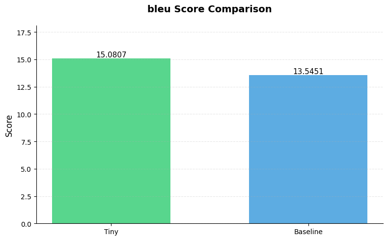
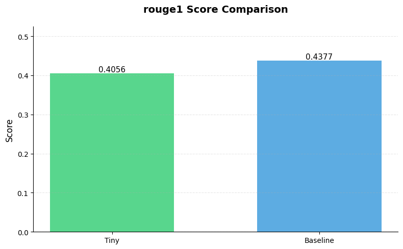
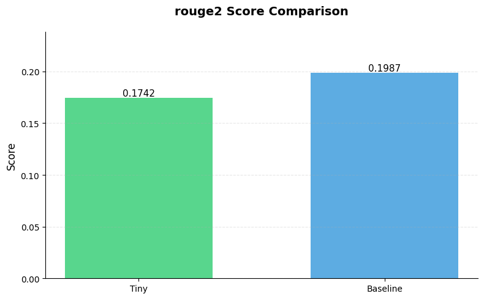
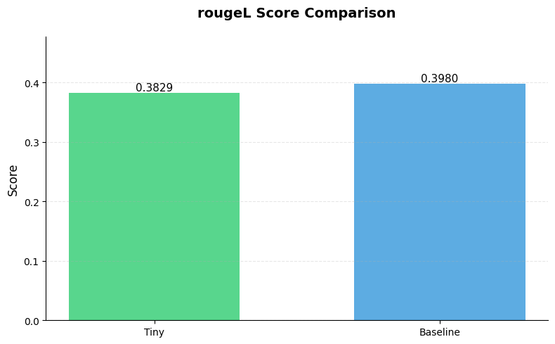
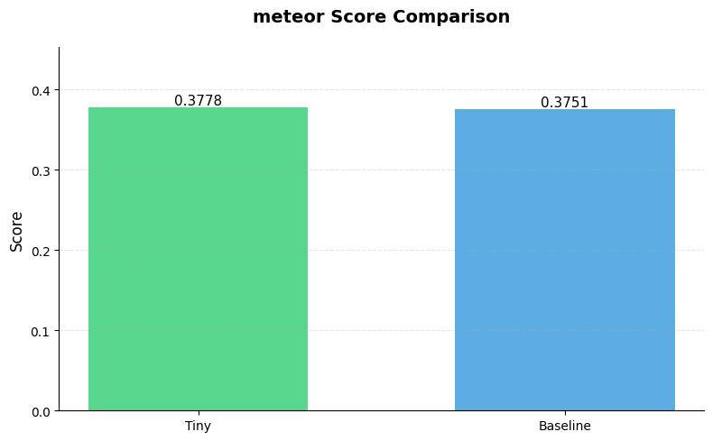

# 0. Batch API result processing
The notebook includes a practical demonstration using a sample diff:
- Generates commit messages using both models
- Shows the target (actual) commit message
- Provides a detailed evaluation comparing both generated messages
This gives a concrete example of how the models perform in practice.


```python

#  import json
#  import pandas as pd

#  df = pd.read_csv("comparisons.csv")

#  tiny_scores = []
#  baseline_scores = []

#  with open("evaluation_output_500.jsonl", "r") as f:
#      for line in f:
#          evaluation = json.loads(line)
#          # Extract scores from the response
#          response_content = json.loads(evaluation["response"]["body"]["choices"][0]["message"]["content"])
#          tiny_scores.append(response_content["tiny_score"])
#          baseline_scores.append(response_content["baseline_score"])

#  result_df = df.head(500).copy()
#  result_df["tiny_score"] = tiny_scores
#  result_df["baseline_score"] = baseline_scores

#  result_df["score_difference"] = result_df["tiny_score"] - result_df["baseline_score"]

#  result_df.to_csv("evaluation_results.csv", index=False)
```

# 1. Setup and Model Loading

This notebook demonstrates a comparison between two commit message generation models:
- Our fine-tuned model (loaded from a specific checkpoint)
- A baseline model (JetBrains-Research/cmg-codet5-without-history)

The setup includes importing necessary libraries and configuring the environment to use either CPU or GPU (CUDA) depending on availability.


```python
import json
import os

import openai
import pandas as pd
import rootutils
import torch
from transformers import AutoModelForSeq2SeqLM, AutoTokenizer

ROOT = rootutils.setup_root(".", ".project-root", pythonpath=True)

from src.demo_inference import load_run

device = torch.device("cuda" if torch.cuda.is_available() else "cpu")
checkpoint_path = (
    ROOT / "logs/train/runs/2025-01-24_23-12-54/checkpoints/epoch_023-val_MRR_top5_0.6524.ckpt"
)
our_model, datamodule = load_run(checkpoint_path)

baseline_tokenizer = AutoTokenizer.from_pretrained("JetBrains-Research/cmg-codet5-without-history")
baseline_model = AutoModelForSeq2SeqLM.from_pretrained(
    "JetBrains-Research/cmg-codet5-without-history"
)
baseline_model = baseline_model.to(device)

csv_path = ROOT / "notebooks/comparisons.csv"
samples = pd.read_csv(csv_path)


openai_client = openai.OpenAI(api_key=os.getenv("OPENAI_API_KEY"))
```

    /Users/rissal.hedna/Desktop/Extras/ML-24-25/src/demo_inference.py:49: FutureWarning: You are using `torch.load` with `weights_only=False` (the current default value), which uses the default pickle module implicitly. It is possible to construct malicious pickle data which will execute arbitrary code during unpickling (See https://github.com/pytorch/pytorch/blob/main/SECURITY.md#untrusted-models for more details). In a future release, the default value for `weights_only` will be flipped to `True`. This limits the functions that could be executed during unpickling. Arbitrary objects will no longer be allowed to be loaded via this mode unless they are explicitly allowlisted by the user via `torch.serialization.add_safe_globals`. We recommend you start setting `weights_only=True` for any use case where you don't have full control of the loaded file. Please open an issue on GitHub for any issues related to this experimental feature.
      checkpoint = torch.load(checkpoint_path, map_location=torch.device("cpu"))  # nosec B614


                                                    prediction                                                                         target
    0                  Add documentation for docs/why-the-dot.                                                        Add docs/why-the-dot.md
    1                        Add zone2dnscontrol documentation                         Add zone2dnscontrol script to convert DNS zonefiles to
    2                    Add Cloudflare provider documentation                                      Add Cloudflare DNS provider documentation
    3                                    Add docs/namecheap.md                                 Add Namecheap registrar provider documentation
    4                       Add migration guide for DNSControl                                            Add docs/migrating.md: Guide for mi
    5           Add reverseaddr functions to transform package                               Add reverse-domain function to transform package
    6   Add build/masterRelease/main.go with release functions                                 Add script to upload master to GitHub release.
    7       Add reverseaddr functions to pkg/transform package                            Add ReverseDomainName function to transform package
    8            Add ActiveDirectory_PS provider documentation                                  Add ActiveDirectory_PS provider documentation
    9            Refactor provider-list.md to provider-list.md  Update provider list to Markdown and add official/contributed support details
    10                               Add test cases for DMARC1                                                Add DMARC backslash parse tests
    11                              Remove js/parse_tests/009-                                                     Remove js/parse_tests/009-
    12                                  Add .editorconfig file                               Add .editorconfig for consistent code formatting
    13                   Add GitHub Actions workflow for build    Add GitHub Actions workflow for build checks on PRs targeting master branch
    14                                   Remove README.md file                                       Remove README.md for convertzone command
    15                           Remove unused README.txt file                                         Remove README.txt and add .gitkeep for


# 2. Model Evaluation Framework

The notebook implements two key evaluation functions:
- `generate_baseline_message()`: Generates commit messages using the baseline CodeT5 model
- `evaluate_messages()`: Uses GPT-4 to evaluate the quality of generated messages compared to target messages on a scale of 1-10

The evaluation considers:
- The input code diff
- Messages from both models
- The target (actual) commit message


```python

def generate_baseline_message(diff: str) -> str:
    """Generate commit message using the baseline model."""
    inputs = baseline_tokenizer(diff, return_tensors="pt", truncation=True, max_length=512)
    inputs = {k: v.to(device) for k, v in inputs.items()}

    with torch.no_grad():
        outputs = baseline_model.generate(**inputs)
    return baseline_tokenizer.decode(outputs[0], skip_special_tokens=True)


def evaluate_messages(baseline_message: str, target_message: str, diff: str) -> dict:
    """Evaluate messages using OpenAI."""
    prompt = f"""Given a code diff and two commit messages (one from a model and one target message), 
    evaluate the model message on a scale of 1-10 based on how well it captures the essence of the target message
    while maintaining clarity and relevance to the changes.

    Code diff:
    {diff}

    Model Message: {baseline_message}
    Target Message: {target_message}

    Provide your response in JSON format:
    {{
        "score": <score>,
        "explanation": "<brief explanation of the score>"
    }}
    """

    response = openai_client.chat.completions.create(
        model="gpt-4o-mini",
        messages=[{"role": "user", "content": prompt}],
        temperature=0.0,
        response_format={"type": "json"},
    )

    return json.loads(response.choices[0].message.content)
```

# 3. Statistical Analysis

The notebook performs comprehensive statistical analysis of the evaluation results, including:
- Basic descriptive statistics for both models' scores
- Analysis based on diff length (categorized into Very Short to Very Long)
- Score distributions and comparisons
- Correlation between diff length and model performance
- Win rate analysis showing the percentage of cases where each model performs better


```python
results_df = pd.read_csv("evaluation_results.csv")

basic_stats = pd.DataFrame({
    'Tiny Model': results_df['tiny_score'].describe(),
    'Baseline Model': results_df['baseline_score'].describe(),
    'Score Difference': results_df['score_difference'].describe()
})
print("Basic Statistics:")
print(basic_stats)

results_df['diff_length'] = results_df['input'].str.len()

results_df['length_bin'] = pd.qcut(results_df['diff_length'], q=5, labels=['Very Short', 'Short', 'Medium', 'Long', 'Very Long'])

length_stats = results_df.groupby('length_bin').agg({
    'tiny_score': ['mean', 'std', 'count'],
    'baseline_score': ['mean', 'std', 'count'],
    'score_difference': 'mean'
}).round(3)
print("\nScores by Diff Length:")
print(length_stats)
```

    Basic Statistics:
           Tiny Model  Baseline Model  Score Difference
    count  500.000000      500.000000         500.00000
    mean     5.304000        7.064000          -1.76000
    std      1.485934        1.151763           1.46516
    min      2.000000        2.000000          -6.00000
    25%      4.000000        6.000000          -3.00000
    50%      5.000000        7.000000          -2.00000
    75%      6.000000        8.000000          -1.00000
    max     10.000000       10.000000           3.00000
    
    Scores by Diff Length:
               tiny_score              baseline_score               \
                     mean    std count           mean    std count   
    length_bin                                                       
    Very Short       5.71  1.445   100           7.46  0.979   100   
    Short            5.64  1.501   100           7.11  1.205   100   
    Medium           5.13  1.482   100           7.03  1.087   100   
    Long             5.00  1.421   100           6.79  1.166   100   
    Very Long        5.04  1.449   100           6.93  1.217   100   
    
               score_difference  
                           mean  
    length_bin                   
    Very Short            -1.75  
    Short                 -1.47  
    Medium                -1.90  
    Long                  -1.79  
    Very Long             -1.89  


    /var/folders/ns/0spd8fg95tv2s7hys988_pb00000gp/T/ipykernel_12482/1134936604.py:15: FutureWarning: The default of observed=False is deprecated and will be changed to True in a future version of pandas. Pass observed=False to retain current behavior or observed=True to adopt the future default and silence this warning.
      length_stats = results_df.groupby('length_bin').agg({


# 4. Visualization
## a. Results
The results are visualized through multiple plots:
- Histograms showing score distributions for both models
- A histogram showing the distribution of score differences
- Box plots comparing score distributions between models
These visualizations help understand the relative performance of both models.


```python
import matplotlib.pyplot as plt
import seaborn as sns

plt.figure(figsize=(15, 5))

plt.subplot(1, 3, 1)
sns.histplot(data=results_df, x='tiny_score', bins=10)
plt.title('Tiny Model Score Distribution')

plt.subplot(1, 3, 2)
sns.histplot(data=results_df, x='baseline_score', bins=10)
plt.title('Baseline Model Score Distribution')

plt.subplot(1, 3, 3)
sns.histplot(data=results_df, x='score_difference', bins=10)
plt.title('Score Difference Distribution')

plt.tight_layout()
plt.show()

plt.figure(figsize=(10, 6))
scores_melted = pd.melt(results_df[['tiny_score', 'baseline_score']], 
                       var_name='Model', value_name='Score')
sns.boxplot(data=scores_melted, x='Model', y='Score')
plt.title('Score Distribution Comparison')
plt.show()

print("\nCorrelation between diff length and scores:")
correlations = pd.DataFrame({
    'Tiny Model': results_df['diff_length'].corr(results_df['tiny_score']),
    'Baseline Model': results_df['diff_length'].corr(results_df['baseline_score'])
}, index=['Correlation with diff length'])
print(correlations)

win_stats = {
    'Tiny Wins': (results_df['score_difference'] > 0).mean() * 100,
    'Baseline Wins': (results_df['score_difference'] < 0).mean() * 100,
    'Ties': (results_df['score_difference'] == 0).mean() * 100
}
print("\nWin Rate Analysis (%):")
print(pd.Series(win_stats).round(2))
```

## b. Metrics
The notebook calculates and visualizes various metrics for the generated commit messages:
- BLEU, ROUGE, BERTScore, and METEOR scores for both models
- Visualization of score distributions for each metric
- Comparison of average metrics between models
These metrics provide a comprehensive evaluation of the generated commit messages.
import pandas as pd


```python
import pandas as pd
import sacrebleu
from nltk.translate import meteor_score
from transformers import AutoTokenizer, AutoModel
import numpy as np
from tqdm import tqdm
from rouge_score import rouge_scorer
import nltk
nltk.download('wordnet')

bert_name = "bert-base-uncased"
tokenizer = AutoTokenizer.from_pretrained(bert_name)
model = AutoModel.from_pretrained(bert_name)

def calculate_metrics(generated_messages, reference_messages):
    """Calculate ROUGE, BLEU, and METEOR metrics."""
    scorer = rouge_scorer.RougeScorer(['rouge1', 'rouge2', 'rougeL'], use_stemmer=True)
    
    metrics = {
        'bleu': [],
        'rouge1': [], 
        'rouge2': [], 
        'rougeL': [],
        'meteor': []
    }
    
    for gen, ref in tqdm(zip(generated_messages, reference_messages), total=len(generated_messages)):
        # BLEU
        bleu = sacrebleu.corpus_bleu([gen], [[ref]], lowercase=True, tokenize="13a").score
        metrics['bleu'].append(bleu)
        
        # ROUGE scores
        rouge_scores = scorer.score(gen, ref)
        metrics['rouge1'].append(rouge_scores['rouge1'].fmeasure)
        metrics['rouge2'].append(rouge_scores['rouge2'].fmeasure)
        metrics['rougeL'].append(rouge_scores['rougeL'].fmeasure)

        # METEOR
        meteor = meteor_score.meteor_score(
            [tokenizer.tokenize(ref)],
            tokenizer.tokenize(gen)
        )
        metrics['meteor'].append(meteor)
    
    return {k: np.mean(v) for k, v in metrics.items()}
def plot_metrics():
    df = pd.read_csv("comparisons.csv")
    
    print("Calculating metrics...")
    tiny_metrics = calculate_metrics(df['t5-efficient-extra-tiny'], df['target'])
    baseline_metrics = calculate_metrics(df['baseline-cmg-codet5-without-history'], df['target'])
    
    metrics_df = pd.DataFrame({
        'Tiny': tiny_metrics,
        'Baseline': baseline_metrics
    })
    
    colors = {
        'Tiny': '#2ecc71',
        'Baseline': '#3498db'
    }
    
    for metric in metrics_df.index:
        plt.figure(figsize=(8, 5))
        data = [metrics_df.loc[metric, 'Tiny'], metrics_df.loc[metric, 'Baseline']]
        bars = plt.bar(['Tiny', 'Baseline'], data, 
                      color=[colors['Tiny'], colors['Baseline']],
                      alpha=0.8,
                      width=0.6)
        
        plt.title(f'{metric} Score Comparison', pad=20, fontsize=14, fontweight='bold')
        plt.ylabel('Score', fontsize=12)
        plt.ylim(0, max(data) * 1.2)
        
        plt.grid(axis='y', linestyle='--', alpha=0.3)
        
        for bar in bars:
            height = bar.get_height()
            plt.text(bar.get_x() + bar.get_width()/2., height,
                    f'{height:.4f}',
                    ha='center', va='bottom',
                    fontsize=11)
        
        plt.gca().spines['top'].set_visible(False)
        plt.gca().spines['right'].set_visible(False)
        
        plt.tight_layout()
        plt.show()
    
    print("\nMetric Summary:")
    print(metrics_df.to_string(float_format=lambda x: '{:.4f}'.format(x)))

plot_metrics()
```

    [nltk_data] Downloading package wordnet to
    [nltk_data]     /Users/rissal.hedna/nltk_data...
    [nltk_data]   Package wordnet is already up-to-date!


    Calculating metrics...


    100%|██████████| 16462/16462 [00:04<00:00, 3469.08it/s]
    100%|██████████| 16462/16462 [00:04<00:00, 3634.47it/s]


    

    


    

    


    

    


    

    


    

    


    
    Metric Summary:
              Tiny  Baseline
    bleu   15.0807   13.5451
    rouge1  0.4056    0.4377
    rouge2  0.1742    0.1987
    rougeL  0.3829    0.3980
    meteor  0.3778    0.3751


# 5. Sample Evaluation
The notebook includes a practical demonstration using a sample diff:
- Generates commit messages using both models
- Shows the target (actual) commit message
- Provides a detailed evaluation comparing both generated messages
This gives a concrete example of how the models perform in practice.


```python
from src.demo_inference import generate_commit_message
from src.evaluate_commits import CommitMessageEvaluator

evaluator = CommitMessageEvaluator(openai_api_key=os.getenv("OPENAI_API_KEY"))

sample = samples.iloc[0]
print("Sample 1 Diff:\n", sample["input"][:200] + "...\n")

our_message = generate_commit_message(our_model, sample["input"])
baseline_message = generate_baseline_message(sample["input"])

print("Our Model's Message:", our_message)
print("Baseline Message:", baseline_message)
print("Target Message:", sample["target"])

evaluation = evaluator.evaluate_messages(
    tiny_message=our_message,
    baseline_message=baseline_message,
    target_message=sample["target"],
    diff=sample["input"],
)
print("\nEvaluation:", json.dumps(evaluation, indent=2))
```

    Sample 1 Diff:
     new file docs/why-the-dot.md +--- +layout: default +--- + +# Why CNAME/MX/NS targets require a "dot" + +People are often confused about this error message: + + + 1: ERROR: target (ghs.googlehosted.com...
    


    /Users/rissal.hedna/Desktop/Extras/ML-24-25/.venv/lib/python3.12/site-packages/transformers/generation/utils.py:1375: UserWarning: Using the model-agnostic default `max_length` (=20) to control the generation length. We recommend setting `max_new_tokens` to control the maximum length of the generation.
      warnings.warn(


    Our Model's Message: Add documentation for docs
    Baseline Message: docs: add "why the dot"
    Target Message: Add docs/why-the-dot.md
    
    Evaluation: {
      "tiny_score": 3,
      "baseline_score": 7,
      "explanation": "The tiny model message is too vague and does not specify what the documentation is about, resulting in a low score. The baseline model message is more specific, indicating that the documentation is titled 'why the dot', which is relevant to the content of the code diff, earning a higher score. However, it still lacks the clarity of the target message, which directly states the file path and name."
    }

